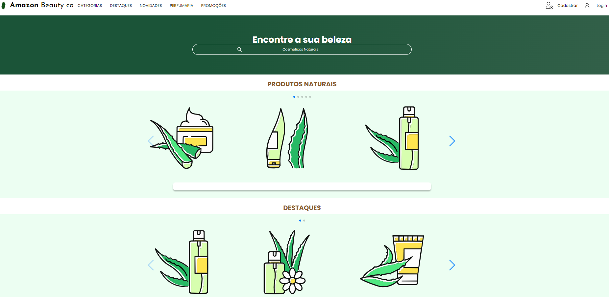
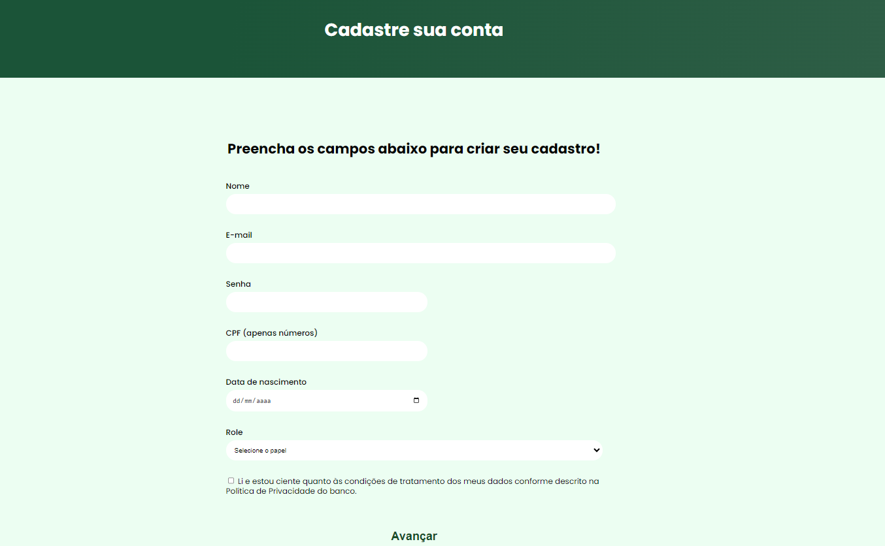
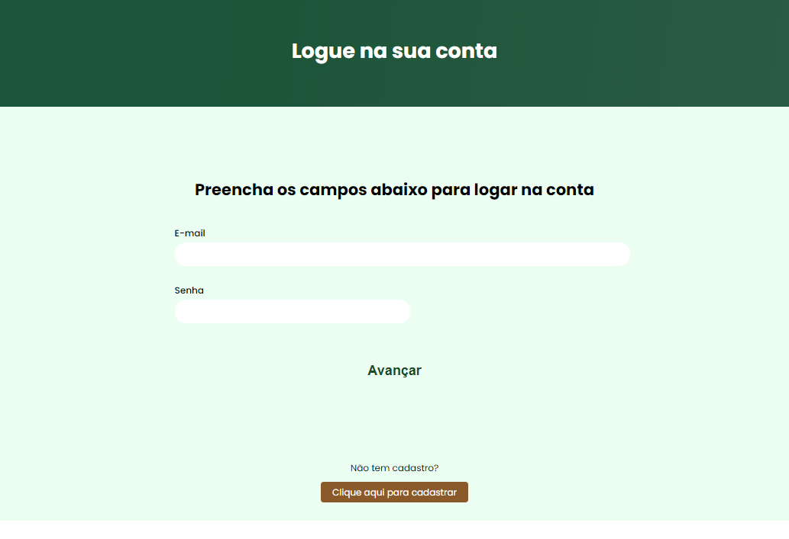
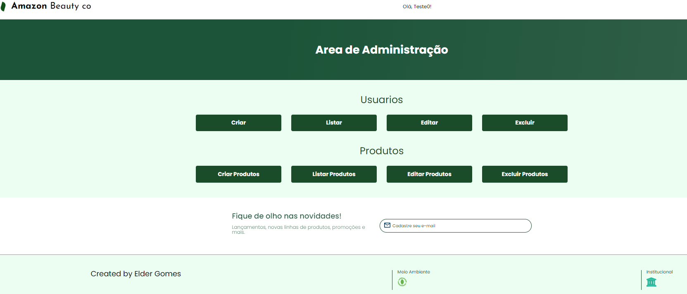

#  **Amazon Beauty co**

**Amazon Beauty co** é uma API para uma loja de cosméticos naturais, parte de um projeto proposto pela **Alura** e pelo **GRUPO BOTICÁRIO**,Este projeto inclui uma interface para a gestão de usuários, permitindo a administração eficiente dos dados dos clientes. A API oferece funcionalidades para cadastro, edição e listagem de usuários, facilitando a administração de uma base de clientes para a loja.



### Tecnologias Utilizadas
- **Frontend**: HTML, CSS, JavaScript
- **Backend**: Node.js, Express
- **Banco de Dados**: MongoDB

## Instalação

1. **Clone o repositório**:

    ```bash
    git clone https://github.com/eldergsilva/Projeto-Pratico.git
    ```

2. **Navegue até o diretório do projeto**:

    ```bash
    cd Projeto-Pratico
    ```

3. **Instale as dependências**:

    Navegue para o diretório `api` e execute:

    ```bash
    cd api
    npm install
    ```

4. **Configure o banco de dados MongoDB**:
Crie uma conta gratuita no [MongoDB Atlas](https://www.mongodb.com/cloud/atlas).  
Crie um Cluster e configure um usuário com acesso ao banco de dados.  
Obtenha a URI de conexão e adicione ao arquivo `.env` do projeto:  

    - Crie um arquivo `.env` na pasta `api` com as seguintes variáveis de ambiente:

      ```dotenv
      MONGODB_URI=<SUA_URI_DO_MONGODB>
      JSON_SECRET=<SEU_SEGREDO_JSON>
      ```

    - Substitua `<SUA_URI_DO_MONGODB>` com a URI de conexão do MongoDB e `<SEU_SEGREDO_JSON>` com um segredo para JWT.

5. **Inicie o servidor**:

    Na pasta `api`, execute:

    ```bash
    npm run start
    ```

## Uso

- Acesse o front-end na pasta `app` através do arquivo `index.html` para testar a interação com a API.

## Funcionalidades

- **Cadastro de Usuário**: Permite aos usuários se registrarem.
  
- **Login de Usuário**: Permite aos usuários fazer login.
  
- **CRUD de Usuário**: Cadastrar, buscar, editar e deletar usuários.
  
- **CRUD de Produto**: Adicionar, buscar, editar e deletar produtos.
- **CRUD de Carrinho** (em desenvolvimento).

## Testes

- Execute os testes automatizados:

    ```bash
    cd api
    npm run test:usuario:service
    npm run test:produto:service
    ```

## Capturas de Tela

### Tela Inicial


### Tela de Cadastro


## Visualização do Front-End

Você pode visualizar o front-end do projeto em [GitHub Pages](https://eldergsilva.github.io/Projeto-Pratico/). 

Esta versão é apenas a interface visual do projeto e não está conectada ao backend. Portanto, funcionalidades como login, cadastro de usuários e interação com o banco de dados não estarão disponíveis. No entanto, você poderá explorar o design e a estrutura da aplicação.

Sinta-se à vontade para testar a parte visual e fornecer feedback!

 

## Contato

Para mais informações ou dúvidas, entre em contato com [Elder Gomes](mailto:eldergsilva@gmail.com).
